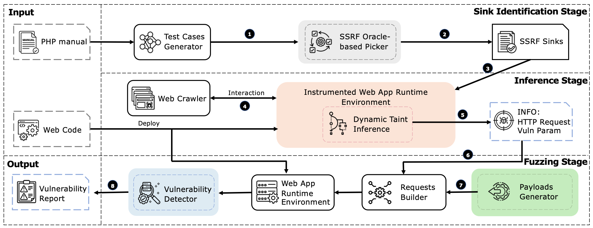

# Where URLs Become Weapons: Automated Discovery of SSRF Vulnerabilities in Web Applications

## Overview

We present a novel methodology, SSRFuzz, to effectively identify SSRF vulnerability in PHP web applications. Our methodology consists of three phases. In the initial phase, we designed an SSRF oracle to examine functions in PHP manuals and identify sinks that provide server-side request capabilities. This process yielded a total of 86 sensitive PHP sinks out of 2101 PHP functions. The second stage involves dynamic taint inference and the utilization of the identified sinks to examine the source code of target web applications, pinpointing all feasible input points that could trigger these sinks. The final phase employs fuzzing techniques. We generate testing HTTP requests with SSRF payloads, send them to the previously identified input points within the target web applications, and detect if an SSRF vulnerability is triggered. We implemented a prototype of SSRFuzz and evaluated it on 27 real-world applications, including Joomla and WordPress. In total, we discovered 28 SSRF vulnerabilities, 25 of which were previously unreported. We reported all the vulnerabilities to the affected vendors, and 16 new CVE IDs were assigned.




## How to cite us?

This tool is based on our latest research,"Where URLs Become Weapons: Automated Discovery of SSRF Vulnerabilities in Web Applications", accepted at IEEE S&P 24.

If you want to cite us, please use the following (BibTeX) reference:

```
@inproceedings{sp2024ssrfuzz,
  title={{Where URLs Become Weapons: Automated Discovery of SSRF Vulnerabilities in Web Applications}},
  author={Enze Wang and Jianjun Chen and Wei Xie and Chuhan Wang and Yifei Gao and Zhenhua Wang and Haixin Duan and Yang Liu and Baosheng Wang},
  booktitle={2024 IEEE Symposium on Security and Privacy  (S\&P)},
  year={2024},
}
```

## Installation

### System Requirements

- Ubuntu 18.04
- PHP <= 7.4
- Python3

### Configuration Example

We'll use a code example from the `verify` directory to demonstrate how to run and use SSRFuzz.

1. Clone the modules to a non-web directory, e.g., `/opt/SSRFuzz`:

```sh
git clone https://github.com/SSRFuzz/SSRFuzz.git /opt/SSRFuzz
```

2. Install dependencies:

For TaintInfer:
```sh
composer install
```

For Fuzzer and Detector:
```sh
pip install -r requirements.txt
```

3. Download and compile zmark:

- [Install zmark](https://github.com/SSRFuzz/zmark)

4. Modify the `ssrfuzz.ini` configuration file:

- Set `auto_prepend_file` to `/opt/TaintInfer/src/Entry.php`
- Set `extension` to the path of `zmark.so`
- Copy the remaining content from the `ssrfuzz.ini` in this project

### Database Configuration

Open `/opt/SSRFuzz/src/Config.php` with an editor and set the following:

```php
define("TAINTINFER_FUZZER_DSN", "");                  // fuzzer dsn address
define("TAINTINFER_SENTRY_DSN", "");                  // sentry dsn address
define("TAINTINFER_TAINT_ENABLE", true);              // enable taint mode
define("TAINTINFER_TANZI", "xtanzi");                 // payload keyword
define("TAINTINFER_LOG_FILE", "/data/taintinfer/taintinfer.log"); // log file
```

Create two databases: `ssrf_info` and `ssrf_vuln`:

```sql
CREATE TABLE `ssrf_info` (
  `id` int unsigned NOT NULL AUTO_INCREMENT,
  `param` varchar(255) DEFAULT NULL,
  `Av1` varchar(255) DEFAULT NULL,
  `Av2` varchar(255) DEFAULT NULL,
  `Bv1` varchar(255) DEFAULT NULL,
  `Bv2` varchar(255) DEFAULT NULL,
  `requests` mediumtext,
  `vulntype` varchar(255) DEFAULT NULL,
  PRIMARY KEY (`id`)
) ENGINE=InnoDB DEFAULT CHARSET=utf8mb4 COLLATE=utf8mb4_0900_ai_ci;

CREATE TABLE `ssrf_vuln` (
  `id` int unsigned NOT NULL AUTO_INCREMENT,
  `vulnparam` varchar(255) DEFAULT NULL,
  `vulntype` varchar(255) DEFAULT NULL,
  PRIMARY KEY (`id`)
) ENGINE=InnoDB AUTO_INCREMENT=2 DEFAULT CHARSET=utf8mb4 COLLATE=utf8mb4_0900_ai_ci;

CREATE TABLE `check_info` (
  `id` int unsigned NOT NULL AUTO_INCREMENT,
  `param` varchar(255) DEFAULT NULL,
  `vulnable` varchar(255) DEFAULT '0',
  `stack` mediumtext,
  `body` mediumtext,
  `url` mediumtext,
  PRIMARY KEY (`id`)
) ENGINE=InnoDB AUTO_INCREMENT=2 DEFAULT CHARSET=utf8mb4;
```

### Testing

1. Start the fuzzer and aider_api:

```sh
python3 fuzzer.py
python3 aider_api.py
```

2. Open the test environment:

```bash
cd verify && ./run.sh
```

3. Request example code:

```bash
curl "http://127.0.0.1:8000/param.php?url=1&nnn=2"
```